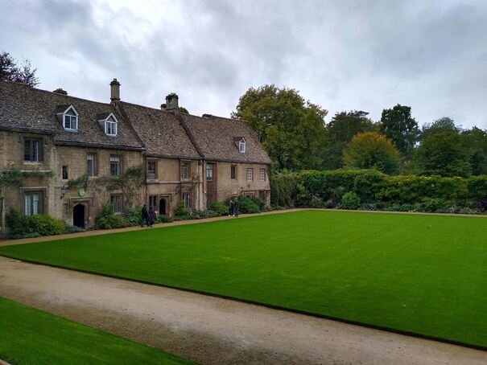
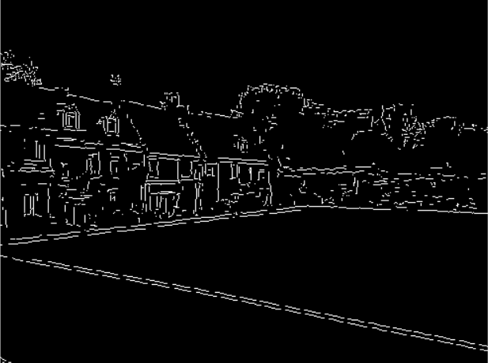
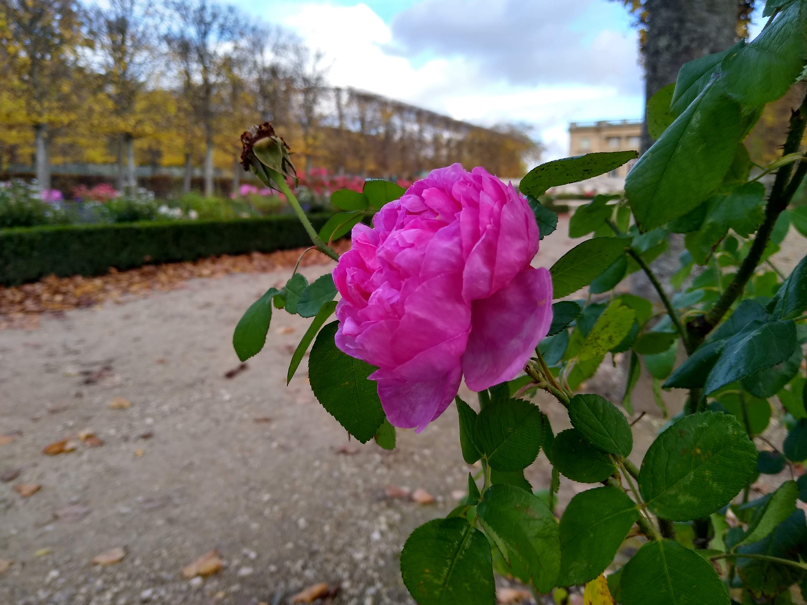
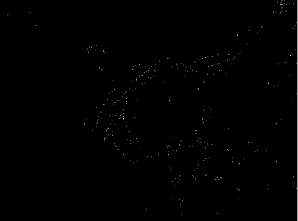
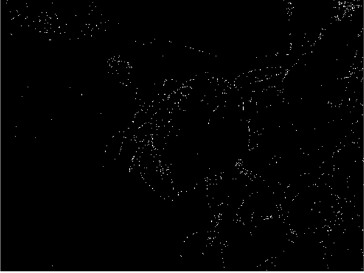
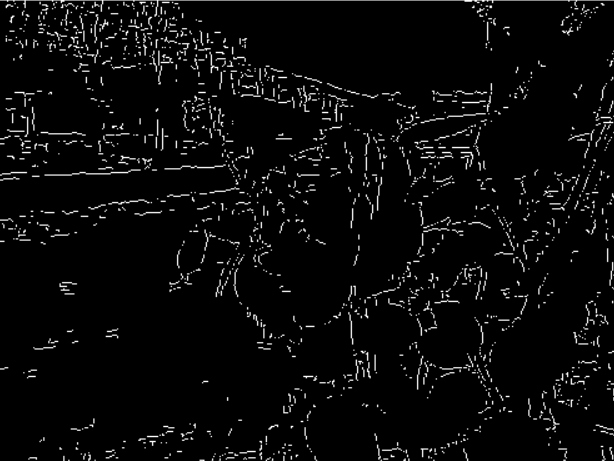

# edgedetection
A beginner project to practice edge detection technology

# Canny Method

### Before 

### After

## Overview
Apparently its one of the most used forms of edge detection and it seems relatively straightforward so I'm going to try it out. It also results in very clear edges, so that's helpful. 

Why it's used according to wikipedia:
1. Detects edges with low error rate. (Detects as many edges as can be found)
2. Edge detected is located where edge is.
3. Edge detected once is not detected twice (image noise doesn not create any false edges) 

The amount of data appears to be minimized compared to other forms of edge detection so I will utilize this in preparation of other computer vision projects that require a degree of edge detection. 

## Usage
Requirements:
- Windows OS (if you want to use on unix system, change canny.py's line 182 to forward slash)
- Python
- Matplotlib
- Numpy

Steps to use:
1. Clone the repository
2. Open terminal and cd to repository
3. run `Python canny.py PATH_TO_PICTURE`

For adjusting and editing:
- adjust kernel size by opening canny.py in an editor and changing the `SIZE` variable. 
- KERNEL SIZE MUST BE ODD.
- adjust the high and low theshold by opening up canny.py in an editor and changing the `HIGH` and `LOW` values. 
- the low threshold is `HIGH` threshold * the maximum value in the image * `LOW`

## Conceptual Design
Very oversimplified goal:
1. Grey scale the picture
2. Identify parts of the picture where the pixel value changes drastically in shade

More in detail blueprint:
1. Grey scale the image
2. Reduce the noise.
3. Calculate the gradients
4. Suppress non-maximum gradients (making the edges thin)
5. Identifying strong, weak and non-relevant pixels
6. Converting weak pixels to strong if there is a strong pixel around it. (edge tracking by hysteresis)

## Technical Design
Libraries to use:
- Matplotlib
- Numpy

Blueprint but techincal:
1. Use ITU-R 601-2 luma transformation
2. Implement gaussian filter from scratch
3. Utilize the sorbel operator to calculate gradient and direction
4. Classify the directions into 4 axises and then suppress the non-maximum gradients.
5. Set a low and high threshold to classify remaining pixels into strong, weak and non-relevant
6. Convert weak pixels to strong if there is a strong pixel around it, and zero out otherwise.

## Results
### Large Versailles Flower image

### Edgy Large Versailles Flower image with more blurring (kernel = 5, high:low thres = 0.2 : 0.2)

### Edgy Large Versailles Flower image with less blurring (kernel = 3, high:low thres = 0.175 : 0.03)

- Using a smalli-ish image size (600x400) small gaussian kernel generally results in a stronger and extensive line detection. 
- However as image sizes get larger, image detection starts failing and only spots and outlines can be detected. 
- Furthermore, lower thresholds for strogness results in more extensive line detection.
- Also a more visually messy picture ends up with a lot of stray edges getting captured as well as seen below:

### Small Versailles Flower (kernel = 5)

